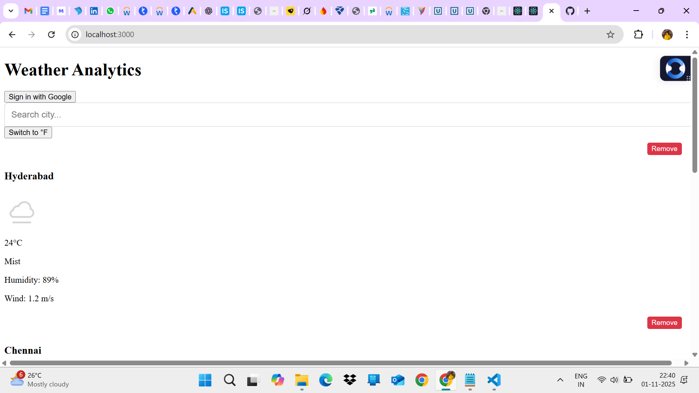
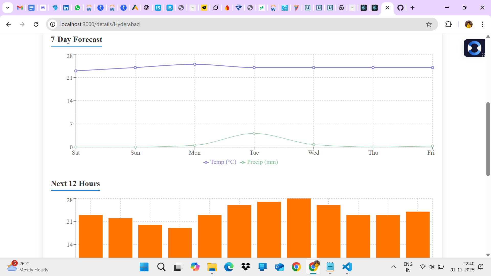
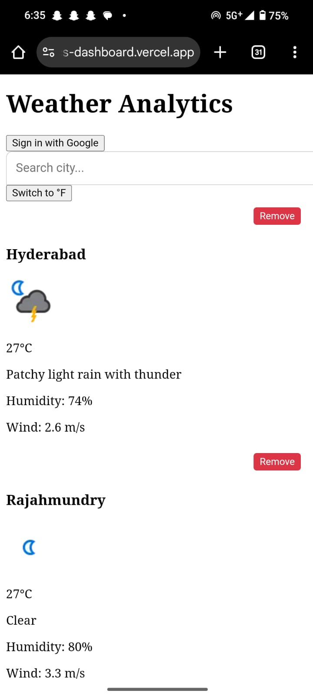

# Weather Analytics Dashboard

A **real-time, multi-city weather analytics dashboard** built with **React, TypeScript, Redux Toolkit, and Recharts**. Features interactive charts, persistent favorites, Celcius to fahrenheit toggle, Google Authentication, and responsive design.

---

## Live Demo
[https://weather-analytics-dashboard.vercel.app/](https://weather-analytics-dashboard.vercel.app/)

## GitHub Repository
[https://github.com/santhosh1188/weather-analytics-dashboard](https://github.com/santhso1188/weather-analytics-dashboard)

---

## Features

| Feature | Implemented |
|--------|-------------|
| Multi-city dashboard with weather cards | Yes |
| 7-day forecast + Next 12 Hours | Yes (Line + Bar charts) |
| Interactive visualizations | Yes (Recharts: Line, Bar, Radar) |
| Search with autocomplete | Yes (WeatherAPI.com) |
| Add/Remove cities from favorites | Yes (click **Remove**) |
| Persistent favorites (on refresh) | Yes (Redux Persist) |
| C/F unit toggle (real-time update) | Yes |
| Google Sign-In (Firebase) | Yes (Bonus) |
| Real-time updates (every 60s) | Yes (Polling + caching) |
| Fully responsive (mobile-friendly) | Yes |
| Clean, modern UI with animations | Yes |

---

## Tech Stack

- **Frontend**: React 18, TypeScript, Hooks
- **State Management**: Redux Toolkit + Redux Persist
- **Routing**: React Router DOM v6
- **Charts**: Recharts (interactive, responsive)
- **API**: [WeatherAPI.com](https://www.weatherapi.com/) (current + forecast + search)
- **Auth**: Firebase Google Auth
- **Styling**: CSS Modules + Responsive Grid
- **Build Tool**: Create React App (react-scripts 5.0.1)

---

## Project Structure
weather-analytics-dashboard/
├── public/
│   └── index.html
├── src/
│   ├── components/
│   │   ├── Dashboard.tsx
│   │   ├── CityCard.tsx
│   │   ├── DetailedView.tsx
│   │   ├── SearchBar.tsx
│   │   └── Settings.tsx
│   ├── redux/
│   │   ├── store.ts
│   │   ├── weatherSlice.ts
│   │   ├── favoritesSlice.ts
│   │   └── unitsSlice.ts
│   ├── services/
│   │   └── weatherApi.ts
│   ├── types.ts
│   ├── firebase.ts
│   ├── App.tsx
│   ├── index.tsx
│   └── index.css
├── package.json
├── tsconfig.json
└── README.md

---

## Setup & Run Locally

# 1. Clone the repo
git clone https://github.com/santhosh1188/weather-analytics-dashboard.git
cd weather-analytics-dashboard

# 2. Install dependencies
npm install

# 3. Start development server
npm start

# Build for Production
npm run build
The build/ folder is ready for deployment.

# API Used
WeatherAPI.com (Free tier)

## Endpoints:
current.json → Current weather
forecast.json → 7-day + hourly
search.json → City autocomplete

API key is included in code (free tier, no billing).

## screenshots

# Deployment
Deployed using Vercel (zero-config):
Vercel
vercel Link: https://weather-analytics-dashboard.vercel.app/

# Author
Santosh
[https://github.com/santhosh1188](url) | [https://www.linkedin.com/in/penupotula-santhosh/](url)

# License
MIT License